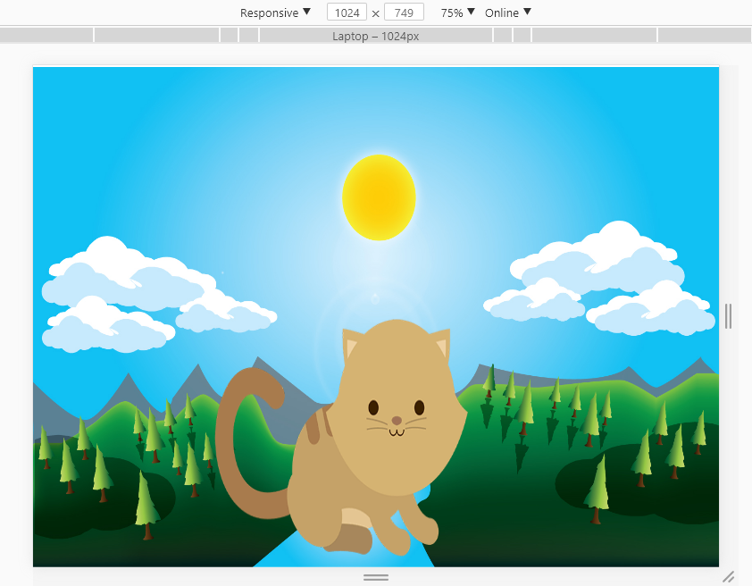
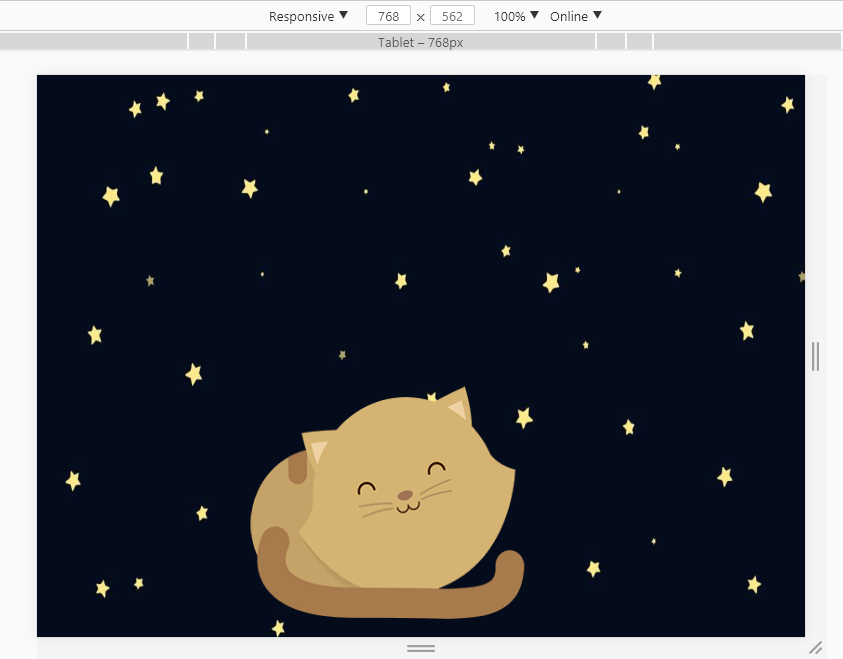
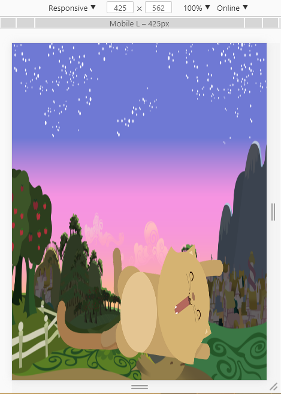

# Kitten

## Objetivo

- El objetivo es crear una página web donde se muestre un paisaje y un gatito diferente a medida que la ventana del navegador se haga más pequeña.

## Flujo de trabajo

- Primero creamos la estructura HTML, en forma anidada.
- Comentar el código.
- Enlazamos el archivo externo del CSS, esto para un mayor orden y hacer uso de las buenas practicas.
- Luego continuamos trabajando en CSS, en forma de cascada.
- Comentar el código.
- Subimos avances a github.
- Terminar de dar estilo con CSS.
- Empezamos a trabajar con los media queries, para adaptar los paisajes y gatitos a la ventana del navegador.
- Comentar el código.
- Subimos avances a github.
- Cumplimos con el objetivo.
- Digitar el archivo README.md
- Subir el producto final a github.
- Crear la rama "gh-pages".

## Herramientas Utilizadas

- html, para la estructura del contenido.
- css, para darle estilo al contenido.
- media queries, para hacer la pagina responsive.

## Fuente consultada

- [Laboratoria LMS] : https://lms.laboratoria.la/cohorts/lim-2017-09-bc-core-pm/courses/social-network/00-rwd/00-opening
- [J&G Proyectos web] : https://www.youtube.com/watch?v=nOjxVmN-obU

## Imagenes  

